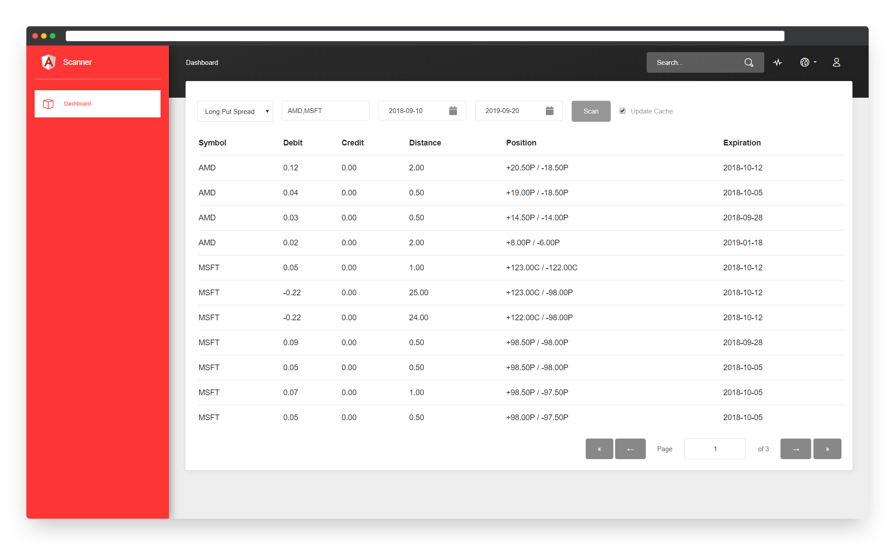

# Options Scanner

Implementation of Yahoo Finance API that allows to find most profitable options by selected criteria.
UI allows to download options for selected symbols and dates, save them to DB, and search for preferable option or their combination in DB.

# Workflow

- Choose preferable option strategy in "Combinations" dropdown 
- Enter one or several comma-separated names of stocks 
- Choose "Start" and "Stop" expiration dates for the options 
- Check the box "Update Cache" if this is the first request and information about stock was not downloaded yet
- With "Update Cache" option ON, scanner will send request to Yahoo API and will save all options to Mongo DB 
- Data from local DB will be used to render possible profitable combinations of option strategies 

# Layers

- Angular 6 
- C# MVC 
- Mongo DB

# Requirements

- Mongo DB needs to be started on port 6000, on Windows you can just run scripts/base.bat to do this
- In Visual Studio, click on solution and restore Nuget packages 
- In Service/Areas/Pages/Application, execute npm install to restore NPM packages
- To make sure that UI works as expected, run scripts/compile.bat to build Angular UI 

# Preview 

